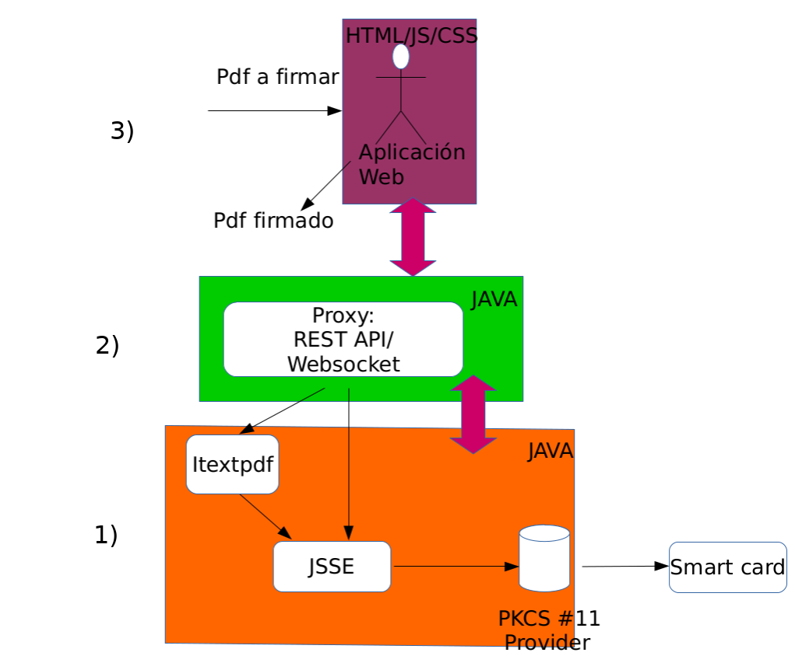

Estructura firmador.
====================

La estructura del firmador se basa en 3 módulos.

1. Módulo librería token/firmador (`javadoc <https://test.adsib.gob.bo/firmador/javadoc/>`_).
2. Módulo servicio rest (`apidoc <https://test.adsib.gob.bo/firmador/apidoc/>`_).
3. Módulo cliente rest (`javascript <https://test.adsib.gob.bo/firmador/jsdoc/>`_).

El bloque 1) descrita en LEEME sección `Funcionalidades de token <README.html#resoluciones>`_

El bloque 2) y 3) descrita en LEEME sección `Firmar Java <README.html#firmar-javascript-api-rest>`_

